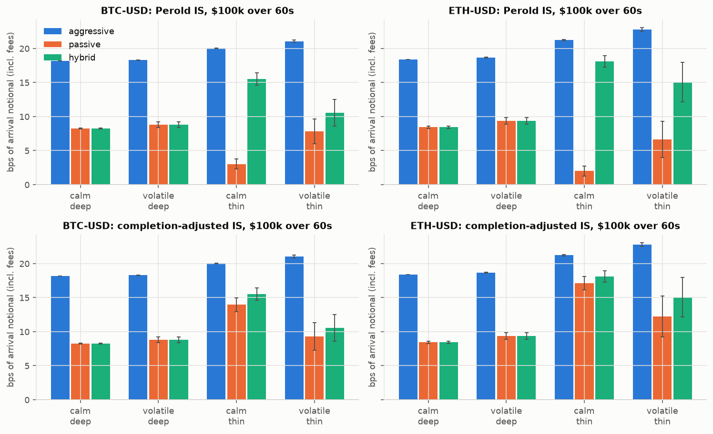

# crypto-execution-lab

[](https://github.com/crollila/crypto-execution-lab/actions/workflows/ci.yml)

Centralized-exchange execution research stack for **BTC-USD and ETH-USD on Coinbase**:
public market-data adapters (REST + WebSocket), a deterministic capture/replay format, an
event-driven exchange simulator (queue position, latency, partial fills, maker/taker fees,
IOC/FOK/post-only/reduce-only, disconnects), a position/P&L ledger, and post-trade TCA.
Experiments compare **passive vs aggressive** execution across volatility/liquidity regimes,
on a real 30-minute Coinbase capture and on seeded synthetic markets calibrated to it.

> **Simulation only. Real-money trading is disabled by construction** — see [Safety](#safety).

Headline results (details and caveats in [ANALYSIS.md](ANALYSIS.md)):

| $100k parent, 60 s, Coinbase 8/18 bps tier | Aggressive IS | Passive IS (optimistic fill model) | Passive IS (prints-only, conservative) |
|---|---|---|---|
| **BTC-USD, real Coinbase tape** (58 runs) | 18.72 ± 0.08 bps | 8.82 ± 0.42 bps (fill 99%) | 13.19 ± 1.45 bps (fill 58%) |
| **ETH-USD, real Coinbase tape** (58 runs) | 19.21 ± 0.07 bps | 8.90 ± 0.57 bps (fill 100%) | 16.35 ± 1.67 bps (fill 28%) |

IS = completion-adjusted implementation shortfall (unfilled size is crossed at the deadline), ±95% CI.
The 10 bp maker/taker fee gap dominates a ~0.02 bp (BTC) / ~0.24 bp (ETH) spread; how much of
it passive execution actually keeps depends on fill probability, which is the main model risk.
In thin synthetic books the passive edge disappears at size (BTC $1M: 23.5 vs 21.6 bps).



## Quick start

```bash
pip install -e ".[dev]"
```

```bash
python -m execlab reproduce
```

That one command regenerates every CSV in `results/` and every PNG in `figures/` **offline**
from the committed capture (`data/samples/`), bit-for-bit deterministically (~4 min on 8 cores;
`--quick` runs a 20-second smoke version, which CI runs twice and diffs). `scripts/reproduce.sh`
and `make reproduce` wrap the same thing plus tests.

Other commands:

```bash
python -m execlab snapshot --product BTC-USD            # live public REST book + prints
python -m execlab snapshot --product BTC-USD --sandbox  # Coinbase public sandbox market data
python -m execlab capture --seconds 600 --out data/samples/my_capture.jsonl.gz
python -m execlab stats data/samples/coinbase_btc_eth_20261005.jsonl.gz
pytest -q                 # 72 offline tests
pytest -m network -q      # 3 live public-endpoint smoke tests (prod + sandbox)
```

## What's inside

```
src/execlab/
  safety.py            hard boundary: GET-only, public host/path/channel allowlists, no signing code
  types.py             normalized Trade / BookSnapshot / Status / ProductSpec
  book.py              incremental L2 book (snapshot + deltas, crossed-book detection)
  adapters/rest.py     MarketDataRest interface + Coinbase Exchange public REST (rate limit, retry/backoff)
  adapters/ws.py       Coinbase Advanced Trade public WS: level2 + market_trades + heartbeats,
                       sequence-gap detection -> resync, stale-feed detection, jittered exp. backoff
  capture.py, io.py    capture to delta-encoded JSONL.gz (keyframes every 60 s); exact, ordered replay
  sim/exchange.py      matching simulator: market/limit, GTC/IOC/FOK, post_only, reduce_only,
                       queue position, partial fills, shadow depth depletion, latency, cancel races,
                       disconnect (cancel-on-disconnect or not), tick/lot/min-notional validation
  sim/fees.py          maker/taker schedules (Coinbase-Advanced-shaped tiers, rebate venue)
  sim/latency.py       lognormal + spike latency model; Poisson outage model
  ledger.py            average-cost position, realized/unrealized P&L, fees, cash (identity-tested)
  strategies.py        aggressive (collared IOC), passive (post-only join + reprice), hybrid (passive -> cross)
  runner.py, tca.py    drive one parent order; arrival-mid TCA, Perold + completion-adjusted IS, markouts
  synth.py             seeded jump-diffusion L2 generator with informed pick-offs + noise takers
  calibrate.py         microstructure stats from a capture; fits the synthetic base regime to it
  experiments.py       regime grid, real-tape replay, size sweep, fee tiers, latency/outage, fill model
  figures.py           all plots
```

## Data

`data/samples/coinbase_btc_eth_20261005.jsonl.gz` (2.4 MB): 30 minutes of BTC-USD and ETH-USD
from Coinbase's public Advanced Trade WebSocket, captured 2026-10-05 00:07–00:37 UTC — 11,884
prints and ~11.8k top-100-level book snapshots (4 Hz), with 0 sequence gaps and 0 reconnects.
Coinbase reports the **maker** side of each print; the adapter flips it to the aggressor side
(validated: 95.5% / 94.2% agreement with the quote rule on BTC / ETH).

| Captured (medians) | BTC-USD | ETH-USD |
|---|---|---|
| spread | 0.0012 bps (1 tick) | 0.073 bps |
| depth within 10 bps, per side | $1.84M (top-100 levels reach ~7.5 bps) | $1.03M |
| realized vol | 0.57 bps/√s | 0.68 bps/√s |
| prints / traded notional | 5.1 /s, $279k/min | 1.5 /s, $89k/min |

## Simulator assumptions

* **No feedback into the replayed market.** Our taker fills deplete a shadow copy of the
  current snapshot until the next snapshot; there is no permanent impact.
* **Latency.** Orders/cancels reach the engine after a sampled one-way latency (default
  lognormal, median 40 ms, 1% spikes) and are matched against the book *at arrival*.
  Cancels can lose the race against fills; a cancel that overtakes its own order is rejected
  as unknown and the strategy re-sends it.
* **Queue position.** Queue-ahead = displayed size at our price on arrival. Prints at our price
  burn queue-ahead first; level shrinkage is treated as cancellations ahead of us
  (queue = min(queue, level)); growth joins behind us.
* **Two passive fill models**, reported side by side as bounds:
  *prints+quotes* (default) also fills a resting order when opposite quotes cross its price
  (sized by the crossing quantity); *prints-only* fills only from public prints at/through
  our price. The real answer lies between them; this is the single largest model risk.
* **Order semantics.** post_only rejects if marketable on arrival (Coinbase behavior);
  reduce_only clips to the reducing position and rejects otherwise (Coinbase *spot* has no
  reduce-only — modeled for derivatives-style accounts); IOC/market remainders cancel;
  FOK is all-or-none against visible depth.
* **Fees** are linear in notional; experiments default to 8/18 bps (Coinbase Advanced
  $1M–15M tier, illustrative) and re-price every run exactly under six schedules.

## Safety

Real-money trading is impossible by construction, enforced in code and tests
(`tests/test_safety.py`):

* `LIVE_TRADING_ENABLED = False`; `LiveOrderGateway()` always raises. The only order
  gateway is the in-process `SimExchange`.
* The HTTP transport has a `get` method and nothing else; every URL is checked against a
  public host allowlist (`api.exchange.coinbase.com`, the public sandbox) and a
  market-data path allowlist (`/products/...`). `/orders`, `/accounts`, `/fills` are refused
  before any I/O.
* WebSocket subscriptions are limited to public channels (`level2`, `market_trades`,
  `heartbeats`, `ticker`); the private `user` channel is refused.
* A test scans the package for signing/credential code (`CB-ACCESS`, `hmac`, `jwt`,
  `api_secret`, `.post(`) and fails if any appears. The repo reads no API keys or env secrets.

**Sandbox:** Coinbase's public sandbox market-data endpoints work without credentials and are
supported (`--sandbox`, `SANDBOX` base URL; it lists only a few products, e.g. no ETH-USD).
Sandbox *order entry* needs API keys, so it is deliberately not implemented.

## Reproducibility

Every random draw comes from an explicit integer seed (paths, latency, outages); strategies
are compared on identical paths and identical latency draws (common random numbers), so
differences are reported as paired means with 95% CIs (`results/paired_*.csv`). CI runs lint,
tests, and the quick reproduction twice, then byte-compares all result CSVs.

## License

MIT
